

  

# scrDbg

scrDbg is a script debugger for RAGE engine games.
It allows you to inspect, manipulate, and debug game scripts in real-time.

## Supported Games

- Grand Theft Auto IV: The Complete Edition
- Grand Theft Auto V (Legacy & Enhanced)

## Planned Support

- Max Payne 3
- Red Dead Redemption
- Red Dead Redemption 2

## Features

- View running scripts
- Pause scripts
- Kill scripts
- Export disassembly, strings, statics, globals, and natives
- Exception handling
- View functions
- View stack
  - View callstack
  - Edit stack frame (function args, locals, temps)
- View disassembly
  - Jump to a raw address
  - Binary search (pattern, hex, decimal, float, string)
  - NOP instructions
  - Apply custom patches
  - Generate patterns
  - View xrefs
  - Set breakpoints
- Logging
  - Log script frame times
  - Log function calls
  - Log native calls with type information
  - Log static and global writes
- Statics editor
- Globals editor

## Screenshots

  
View

  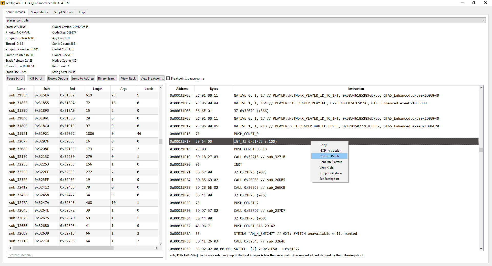

  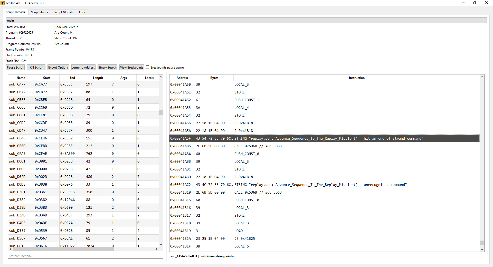

  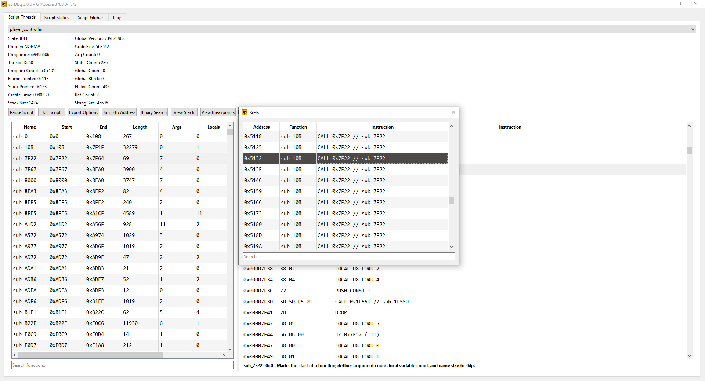

  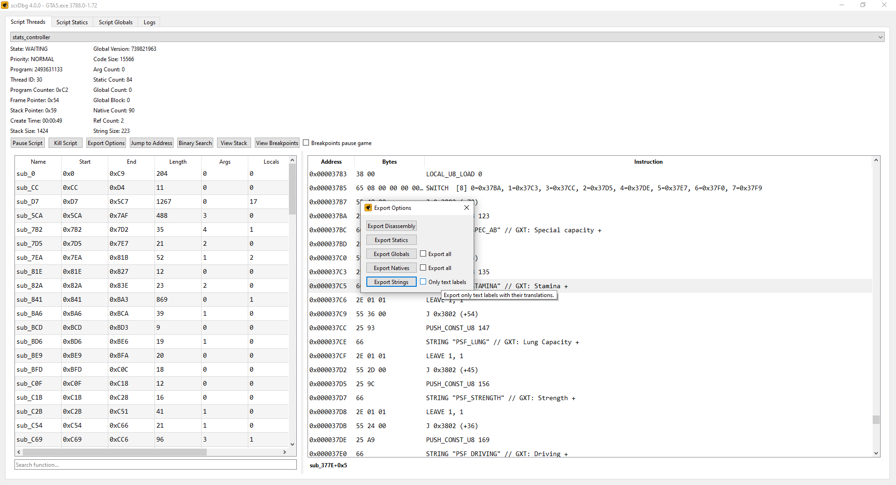

  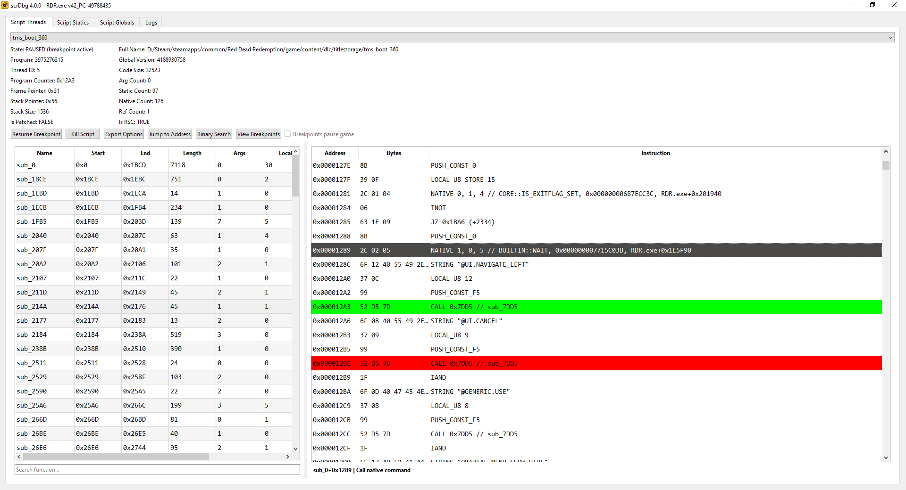

  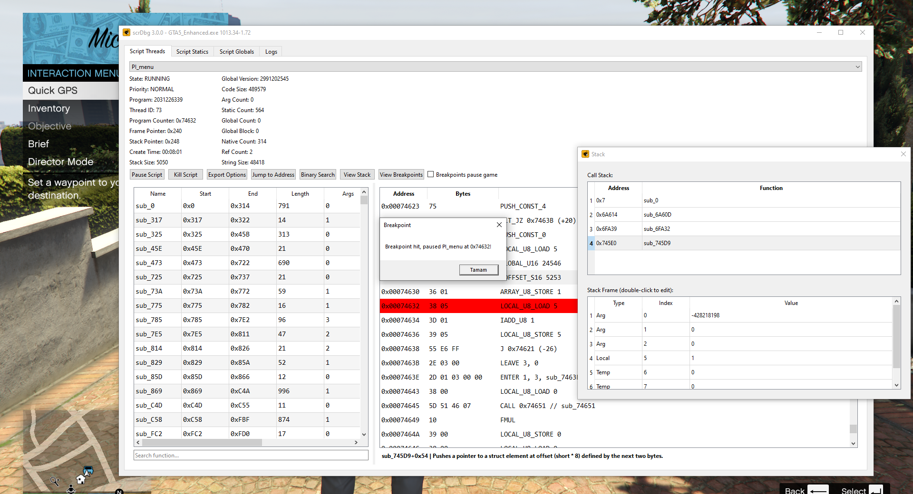

  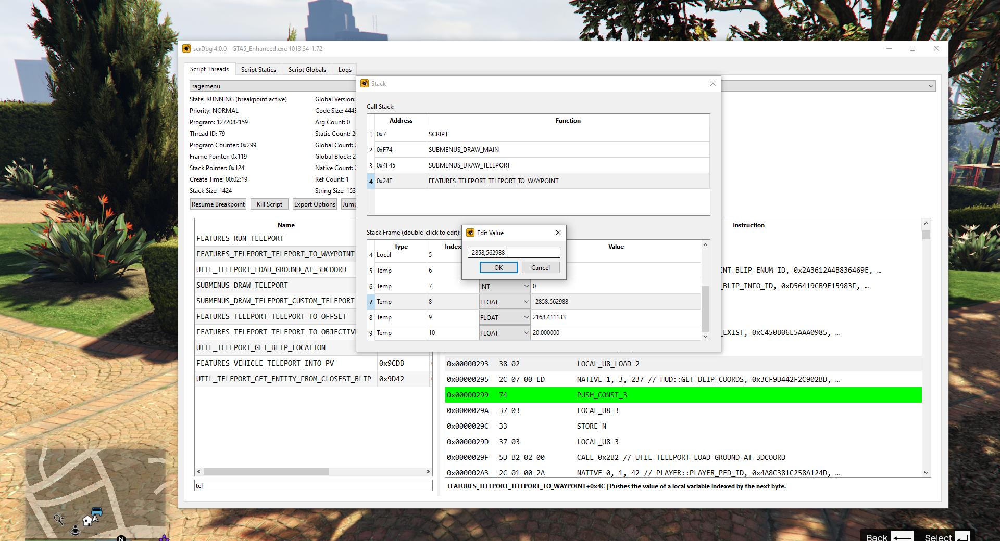

  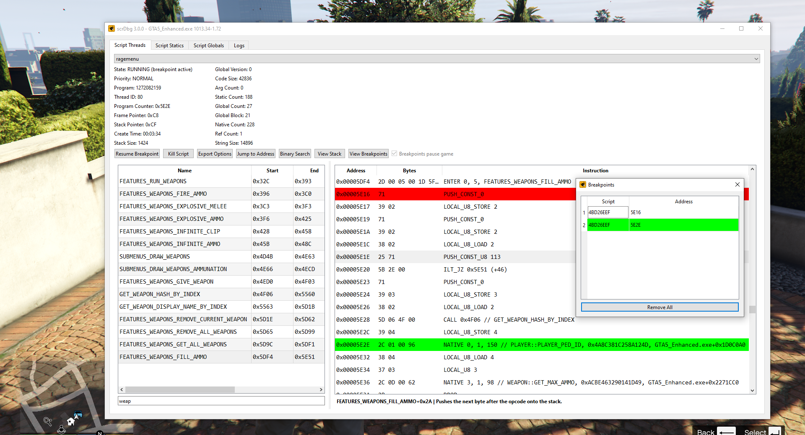

  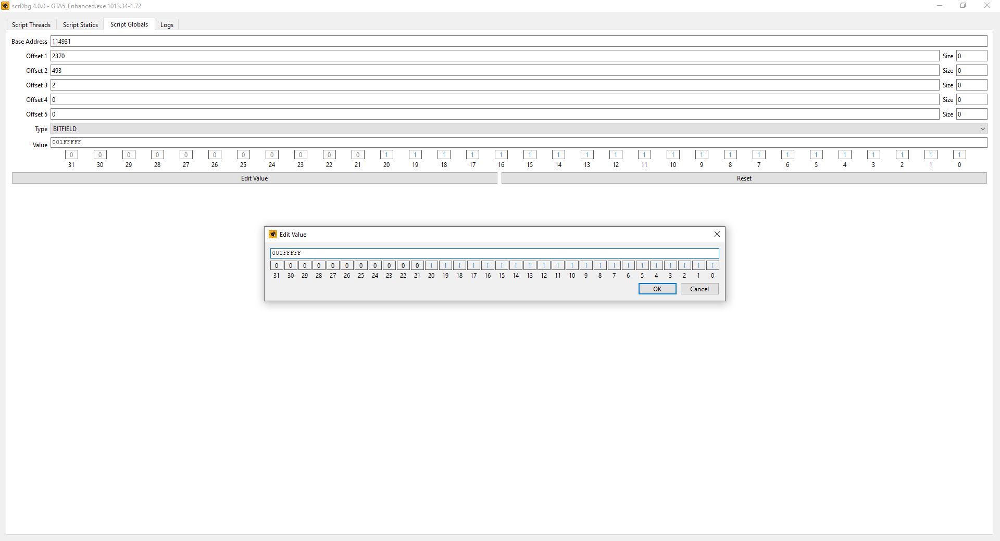

  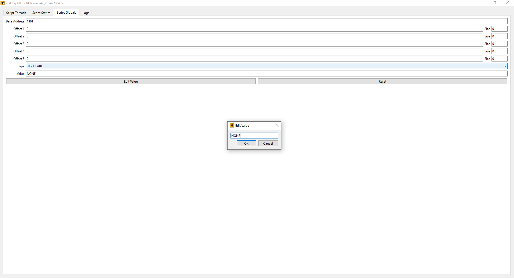

  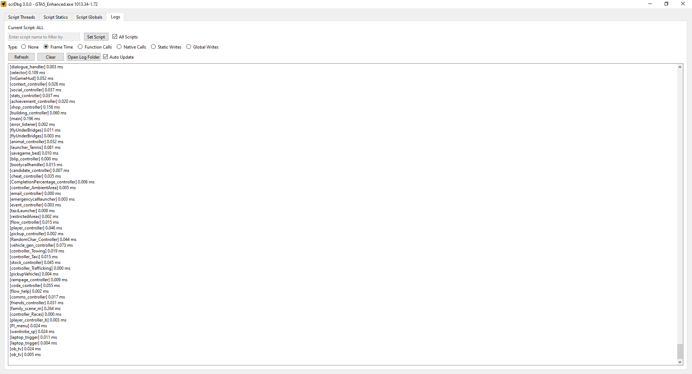

  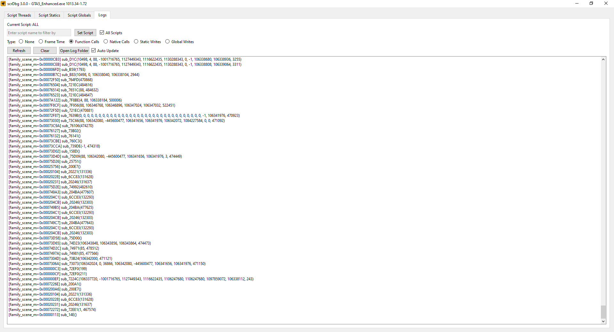

  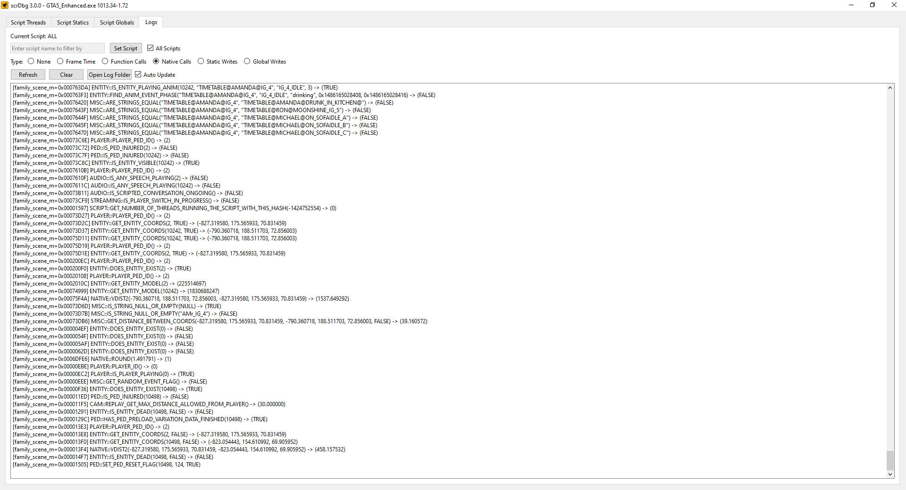

  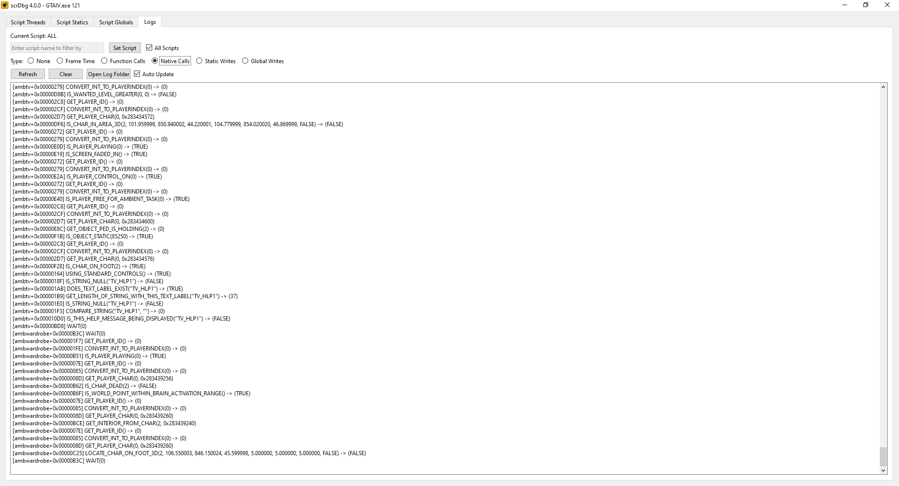

  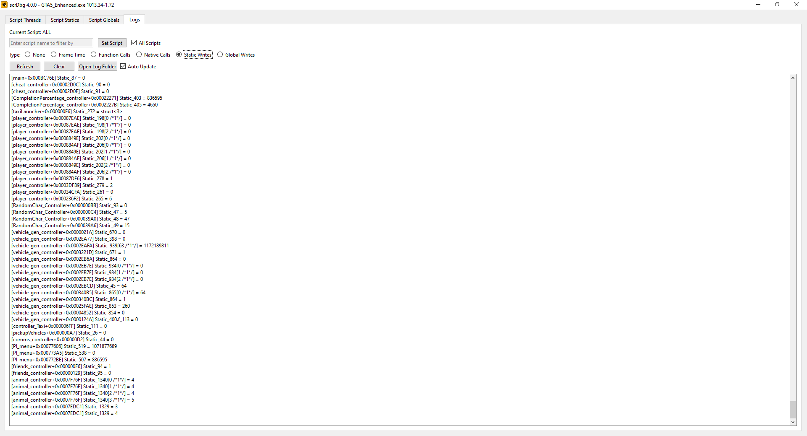

  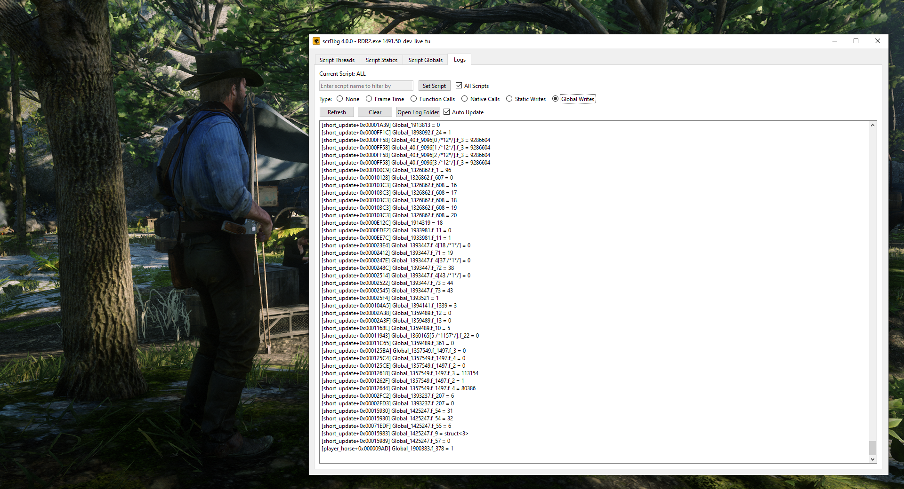

  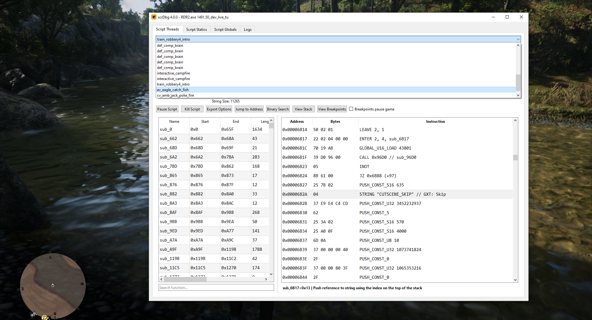

## Usage

- Disable BattlEye from Rockstar Games Launcher for GTA V.
- Launch the game.
- Run `scrDbg.exe`.

## Building

To build scrDbg, you need:

- [Visual Studio 2022](https://visualstudio.microsoft.com/)
  - Desktop development with C++
  - C++ CMake tools for Windows
- [Qt 6.10.0](https://www.qt.io/download-qt-installer-oss)
  - Components for MSVC 2022 64-bit
  - `Qt6_ROOT` environment variable set to your Qt installation (e.g., `<QtInstallFolder>\6.10.0\msvc2022_64\`)

Once you have these installed, you can simply clone the repository, open it in Visual Studio, and build it.

## Credits
- [maybegreat48](https://github.com/maybegreat48) for [External](https://github.com/maybegreat48/External).
- [OldAgario](https://github.com/OldAgario) for logo design.