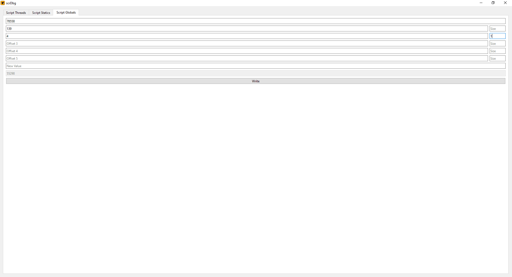

  

# scrDbg

ScrDbg is an external script debugger for Grand Theft Auto V (Legacy & Enhanced).
It allows you to inspect, manipulate, and debug game scripts in real-time.

## Features

- View running scripts
- Pause scripts
- Kill scripts
- Export disassembly, strings, statics, globals, and natives
- View stack
  - View callstack
  - Edit function arguments and locals
- View disassembly
  - Jump to a raw address
  - Binary search
  - NOP instructions
  - Apply custom patches
  - Generate patterns
  - View xrefs
  - Set breakpoints (Enhanced only, requires [ScriptVM.asi](https://github.com/ShinyWasabi/ScriptVM))
- Statics editor
- Globals editor

## Screenshots

  

  

  

  

  

  

  

  

## Usage

- Disable BattlEye from Rockstar Games Launcher.
- Launch the game.
- Run scrDbg.exe.

## Building

To build scrDbg, you need:

- [Visual Studio 2022](https://visualstudio.microsoft.com/)
  - Desktop development with C++
  - C++ CMake tools for Windows
- [Qt 6.10.0](https://www.qt.io/download-qt-installer-oss)
  - Components for MSVC 2022 64-bit
  - `Qt6_ROOT` environment variable set to your Qt installation (e.g., `<QtInstallFolder>\6.10.0\msvc2022_64\`)

Once you have these installed, you can simply clone the repository, open it in Visual Studio, and build it.

## Credits
- [maybegreat48](https://github.com/maybegreat48) for [External](https://github.com/maybegreat48/External).
- TheOldOne for logo design.